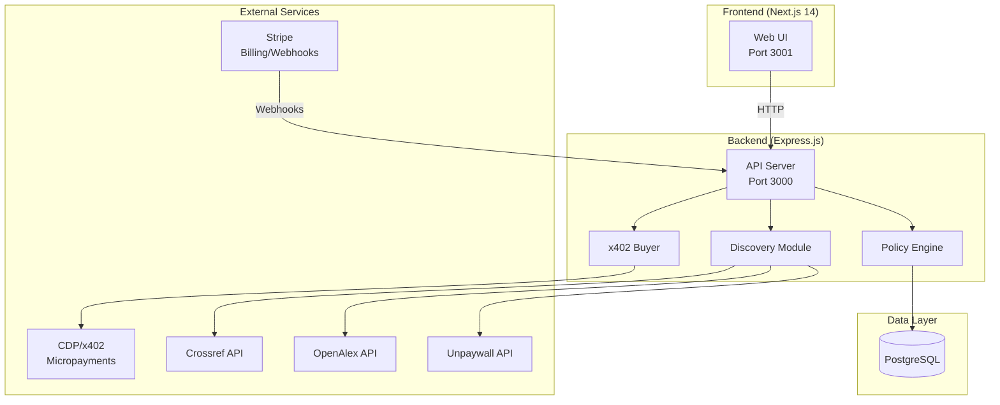

# 🏗️ Architecture - LitPay

---

## High-Level Overview



---

## 🧩 Major Components

### 1. Express API Server (`server.js`)
**Lines:** ~400 | **Evidence:** `server.js:1-200`

**Responsibilities:**
- HTTP routing (REST API)
- Stripe webhook handling with signature verification
- File upload via multer
- CORS configuration for frontend

**Key Routes:**
| Endpoint | Method | Handler |
|----------|--------|---------|
| `/api/session` | POST | Create research session |
| `/api/session/:id` | GET | Get session details |
| `/api/session/:id/search` | POST | Discovery search |
| `/api/session/:id/enrich` | POST | Purchase content via x402 |
| `/api/session/:id/synthesize` | POST | Generate report |
| `/api/policy/can-spend` | POST | Budget check |
| `/webhooks/stripe` | POST | Stripe event handler |

### 2. Policy Engine (`policy.js`)
**Lines:** ~297 | **Evidence:** `policy.js:23-200`

**Purpose:** Enforce budget limits with concurrency safety

**Algorithm:**
1. Acquire row-level lock (`SELECT ... FOR UPDATE` on `policy_lock`)
2. Check per-call maximum (fast path)
3. Create reservation in `policy_reservations`
4. Check daily budget (committed + reserved)
5. Check session cap
6. Check x402 daily ceiling (if provider=x402)
7. Return `allow: true` with `reservationId`

**Concurrency Safety:**
- Uses PostgreSQL advisory locks to serialize concurrent budget checks
- Reservation-before-check pattern prevents race conditions
- **Evidence:** `policy.js:53-61` — "Acquire exclusive row lock on sentinel row"

### 3. Database Layer (`db.js`)
**Lines:** ~323 | **Evidence:** `db.js:1-200`

**Connection Pool:**
- Max connections: 20
- Idle timeout: 30s
- Slow query warning: >1000ms

**Modules:**
- `sessions` — CRUD for research sessions
- `reservations` — TTL-based budget pre-reservations
- `ledger` — Immutable spend audit trail
- `artifacts` — File uploads and reports
- `webhookEvents` — Idempotent webhook processing
- `invoices` — Stripe billing records

### 4. x402 Buyer (`x402-buyer.js`)
**Lines:** ~311

**Flow:**
1. Receive 402 Payment Required from seller
2. Parse `x402-price` and `x402-address` headers
3. Check budget via policy engine
4. Execute CDP payment (base-sepolia network)
5. Retry original request with `x402-receipt` header
6. Commit reservation to ledger

### 5. Discovery Module (`discovery.js`)
**Lines:** ~290

**Sources:**
- Crossref (primary bibliographic data)
- OpenAlex (citation graphs, impact metrics)
- Unpaywall (open access status)

**Utility Scoring Algorithm:**
- Relevance weight: 40%
- Citation count: 25%
- Open access bonus: 15%
- Recency: 20%

---

## 💾 Data Model

### Core Tables

```
sessions
├── id (UUID, PK)
├── user_id (VARCHAR)
├── status (ENUM: active, completed, error)
├── total_cost_cents (INT)
├── created_at, updated_at

policy_reservations
├── id (UUID, PK)
├── session_id (FK → sessions)
├── amount_cents (INT)
├── provider (ENUM: x402, stripe)
├── expires_at (TIMESTAMPTZ)  -- TTL: 15 min
├── committed (BOOLEAN)

spend_ledger
├── id (UUID, PK)
├── session_id (FK → sessions)
├── provider (ENUM)
├── amount_cents (INT)
├── status (ENUM: pending, committed, failed)
├── metadata (JSONB)  -- tx hashes, DOIs
├── created_at

artifacts
├── id (UUID, PK)
├── session_id (FK → sessions)
├── type (ENUM: upload, report, receipt)
├── s3_key (VARCHAR)
├── metadata (JSONB)
```

**Retention:** 7-year audit trail for `spend_ledger`
**Evidence:** `README.md:190-197`

---

## 🔄 Key Flows

### Research Workflow
```
1. Upload (PDF/MD) → Create Session
2. Search → Crossref + OpenAlex + Unpaywall → Utility Scoring
3. Enrich → Policy Check → x402 Payment → Content Retrieval
4. Synthesize → Claude API → Report Generation
```

### Budget Enforcement Flow
```
canSpend(amount, {sessionId, provider})
    │
    ├─▶ Lock policy_lock row (FOR UPDATE)
    ├─▶ Fast path: per-call max check
    ├─▶ Create reservation (visible immediately)
    ├─▶ Query daily total (committed + reserved)
    ├─▶ Query session total
    ├─▶ Query x402 ceiling (if applicable)
    │
    ├─ REJECT → Delete reservation, return reason
    └─ ALLOW → Return reservationId, remaining budget
```

---

## ⚙️ Operational Concerns

### Logging
- Console emoji prefixes: ✅ success, ❌ error, ⚠️ warning, ℹ️ info
- Slow query logging: >1000ms
- Lock contention logging: >100ms wait

### Error Handling
- Stripe webhook: 400 on signature failure, 500 on processing error
- Policy engine: Structured `{allow, reason}` responses
- Database: Connection pool recovery

### Rate Limits (External APIs)
- Crossref: Polite pool (mailto header required)
- OpenAlex: 100k/day for registered users
- Unpaywall: 100k/day

---

## 📈 Scaling Considerations

### Current Bottlenecks
1. **Policy lock contention** — Single row lock serializes all budget checks
   - Mitigation: Low-latency checks (~50ms avg)
   - **Evidence:** `policy.js:59-61` logs contention >100ms

2. **PostgreSQL connection pool** — 20 max connections
   - Mitigation: Short-lived transactions

### Future Improvements (Inferred)
- Sharded policy locks per user/session
- Read replicas for ledger queries
- Redis cache for budget summaries
